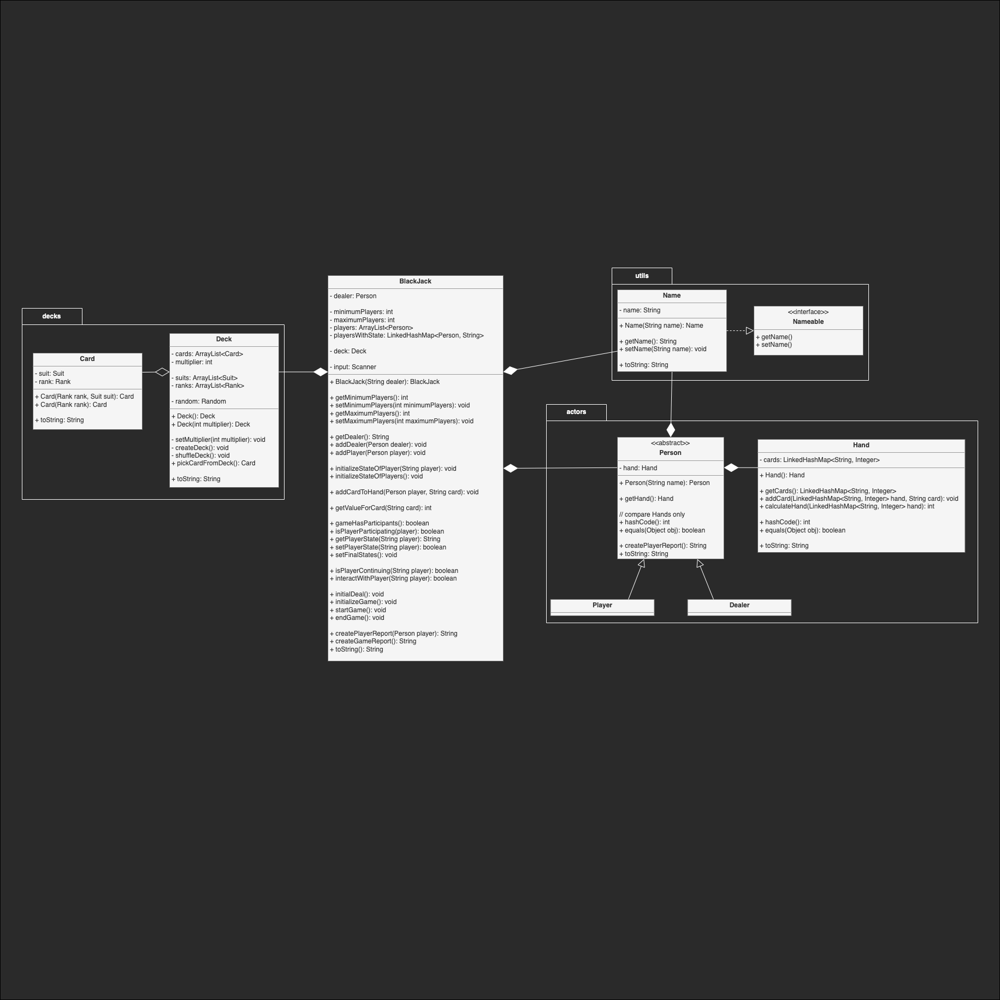

# Implemention of the Card Game App

Main goal is to try and implement an extensible card game using **Java** and it's **Data Structure**.

## Step 1 - A most basic Implementation
The BlackJack Class holds all fields and methods
There is no **Abstraction**, no **Interfaces**.

### Features Used
Just the plain logic to play a game of BlackJack including some features used in Java like:
 - class
 - constructor
 - modifiers (private/public/static)
 - getters/setters
 - lambda functions
 - several types to structure data:
   - int
   - boolean
   - String
   - ArrayList
   - (nested) LinkedHashMap
   - Random
   - Scanner
   - Collections (shuffle)

### Class Diagram

*Biggest Issue so far: implementing the game logic of BlackJack as it is a round based game, where the dealer actually is a player and plays against every other player, while players don't play against each other...*

## Step 2 - Abstract and implement Persons
Create a *abstract* "Person" class and make "Dealer" and "Player" inherit from that. As those are not very specific the default implementation from "Person" will be used.

As "Name" is a field, that will be used often (Dealer, Player, Game, ... later on in Suit and Card too), we make it an abstract too, that implements the interface "Nameable", to achieve a contract for anything that has a Name.

The class "Hand" holds the cards of a "Player".

### Features Used
 - abstract
 - encapsulation
 - interface
 - additional modifiers (final)
 - new types
   - Person
   - Player
   - Dealer
   - Hand

### Class Diagram

*Implementing Hashcode for PERSON to match DEALER and PLAYER was not that trivial.*

## Step 3 - Abstract and implement Deck and Card
Make "Deck" a separated class to create "Card"s. Card

### Features Used
 - switch/case for values asociated with ranks in game
 - new types
   - Deck
   - Card

### Class Diagram

**

## Step 5 - 

## Step 6 - 