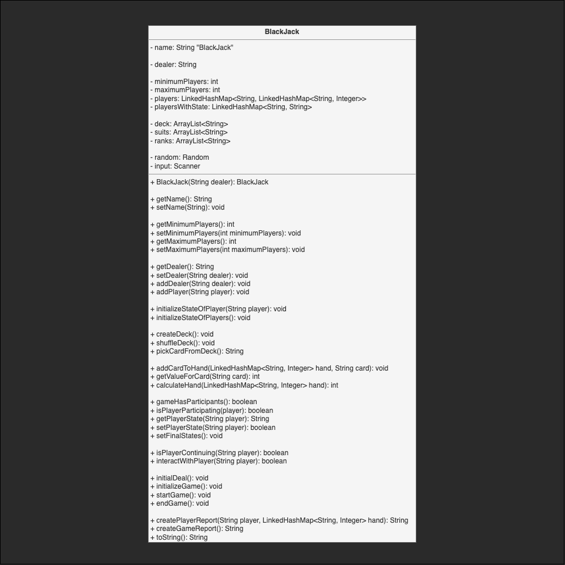

# Implemention of the Card Game App

Main goal is to try and implement an extensible game using **Java** and it's **Data Structure**.

## Step 1 - A most basic Implementation
The Game Class holds all attributes and methods
There is no **Abstraction**, no **Interfaces**.
Just the plain logic to play a game of BlackJack.

## Step 2 - Abstract and implement Persons
Create a Person class and make Dealer and Player inherit from that.

## Step 3 - Abstract and implement Deck
Make Deck a separated class to create Cards.

# Step 4 - Abstract and implement Cards
Make Cards a Class

# Step 5 - 